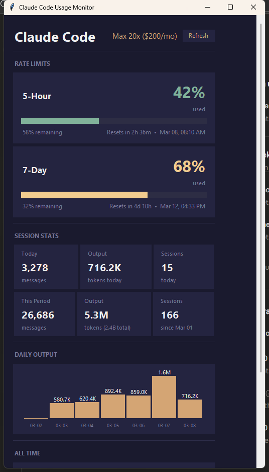
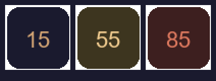

# Claude Code Usage Monitor

A system tray app that shows your **real-time Claude Code usage** — rate limits, reset timers, and token stats — all from a single icon.

[](https://pypi.org/project/claude-usage-tray/)
[](https://pypi.org/project/claude-usage-tray/)


## Screenshot



## Why?

Claude Code doesn't show you how much of your rate limit you've used or when it resets. This app sits in your system tray and gives you that info at a glance — so you never get surprised by a rate limit wall.

## Features

- **Color-coded tray icon** — green/yellow/red based on usage level, shows current % number
- **Live rate limits** from Anthropic's API — 5-hour and 7-day windows with reset countdowns
- **Dashboard** with gauges, stats cards, and daily output chart
- **CLI mode** — `claude-usage --cli` for headless servers and scripting
- **Auto-detect your plan** from Claude Code credentials (Pro, Max 5x, Max 20x)
- **Start on Login** toggle — runs silently in the background
- **Self-update** from the tray menu
- **Cross-platform** — Windows, macOS, Linux
- **No API key required** — uses your existing Claude Code OAuth session

### Tray Icon

The icon changes color and shows your current usage percentage:



- **Green** (< 50%) — plenty of headroom
- **Yellow** (50-80%) — moderate usage
- **Red** (> 80%) — approaching limit

Right-click for quick stats:

```
5-Hour:  42% used  (58% left)  • resets in 2h 14m
7-Day:   38% used  (62% left)  • resets in 4d 11h
──────────────────────────────────────────
Today:  89 msgs  • 1.2M output  • 4 sessions
Since Mar 01:  3.8M output (12.4M total)  • 412 msgs
──────────────────────────────────────────
Open Dashboard
──────────────────────────────────────────
Start on Login  (off)
Create Desktop Shortcut
──────────────────────────────────────────
Check for Updates
GitHub / Help
Refresh
Quit
```

## Quick Start

```bash
pip install claude-usage-tray
claude-usage
```

That's it. The icon appears in your system tray. Right-click for stats, double-click for the dashboard.

**Prerequisites:** [Claude Code](https://docs.anthropic.com/en/docs/claude-code) installed and signed in (`claude` in terminal).

### Other install methods

```bash
# pipx (isolated environment)
pipx install claude-usage-tray

# Latest dev version
pip install git+https://github.com/Bortlesboat/claude-usage-monitor.git

# Clone and run
git clone https://github.com/Bortlesboat/claude-usage-monitor.git
cd claude-usage-monitor
pip install .
```

### CLI Mode

For headless servers, SSH sessions, or scripting:

```bash
claude-usage --cli
```

```
Claude Code Usage Monitor v3.0.0

Rate Limits:
  5-Hour:  42% used (58% remaining)  resets in 2h 37m
  7-Day:   68% used (32% remaining)  resets in 4d 11h

Today: 3,252 messages | 706.1K output tokens | 15 sessions
This Period (since Mar 01): 26,660 messages | 5.2M output | 166 sessions
```

## How It Works

The app reads two data sources — no extra API keys or configuration needed:

| Source | What it provides |
|--------|-----------------|
| **Anthropic OAuth API** | Real-time rate limit windows (5-hour, 7-day), utilization %, reset times |
| **Session JSONL files** (`~/.claude/projects/`) | Token counts by model, daily activity, session history |

Your OAuth token is read from `~/.claude/.credentials.json` (created when you sign in to Claude Code).

### Configuration

The app auto-detects your plan on first run. Config is saved at `~/.claude/usage-monitor-config.json`:

```json
{
  "plan": "max_20x",
  "billing_day": 1
}
```

- `plan`: `free`, `pro`, `max_5x`, or `max_20x`
- `billing_day`: day of month your billing cycle resets (1-28)

## Requirements

- Python 3.10+
- [Claude Code](https://docs.anthropic.com/en/docs/claude-code) installed and signed in

### Linux dependencies

```bash
# Ubuntu/Debian
sudo apt install python3-tk libappindicator3-1

# Fedora
sudo dnf install python3-tkinter libappindicator-gtk3
```

## Troubleshooting

**`claude-usage` command not found (Windows):** Windows Store Python installs scripts to a directory not on PATH. Use `python -m claude_usage_monitor` instead, or install with `pipx`.

**"Sign in to Claude Code first":** Run `claude` in your terminal and complete the sign-in flow.

**"Session expired":** Run `claude` in terminal to re-authenticate.

**No data showing:** Use Claude Code at least once — session files are created in `~/.claude/projects/` after your first conversation.

**Tray icon not visible (Linux):** You may need a system tray extension. On GNOME, install [AppIndicator Support](https://extensions.gnome.org/extension/615/appindicator-support/).

## Updating

Click "Check for Updates" in the tray menu, or:

```bash
pip install --upgrade claude-usage-tray
```

## Contributing

Issues and PRs welcome. To develop locally:

```bash
git clone https://github.com/Bortlesboat/claude-usage-monitor.git
cd claude-usage-monitor
pip install -e ".[dev]"
pytest tests/
```

## License

MIT
